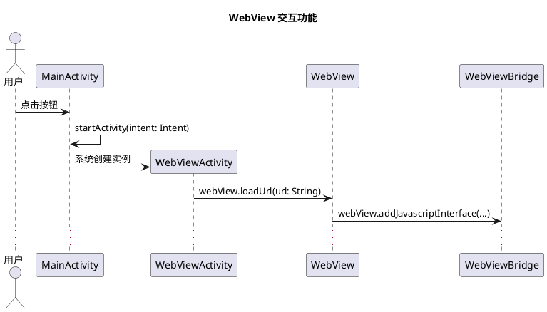

**主要改动**：
1. 重写了“三、代码组织结构（推荐目标）”，明确提出了一个按功能划分的代码包结构（`features/<功能名称>/`），并区分了核心类和辅助扩展。同时说明了与现有结构的差异（作为重构目标）。
2. 强调了代码目录与文档目录的对应关系。
3. 在辅助功能章节中补充了代码层面 `auxiliary/` 子包的组织方式。

这样，`read.md` 既提供了理想的代码组织蓝图，又承认了现状的可迁移性，满足了用户“更加清晰”的要求。请保存此文件。根据您的要求，我修改了 `read.md` 的“三、代码组织结构”部分，提供了一个基于功能划分的理想代码组织方案（`features/<功能名称>/`），并说明了与现有结构的差异。以下是更新后的完整 `developer_doc/read.md` 文件。


# 项目开发与二次开发指南

> 本文档是项目的**核心开发手册**，汇总了所有设计规范、文档结构、任务管理流程和二次开发指南。  
> 遵循本指南，可确保项目长期可维护、可扩展，并支持高效的二次开发。

## 目录

- [一、项目概述](#一项目概述)
- [二、核心设计思想](#二核心设计思想)
- [三、代码组织结构（推荐目标）](#三代码组织结构推荐目标)
- [四、项目文档体系总览](#四项目文档体系总览)
- [五、辅助功能（扩展组件）的组织与管理](#五辅助功能扩展组件的组织与管理)
- [六、代码注释与KDoc规范](#六代码注释与kdoc规范)
- [七、时序图规范](#七时序图规范)
- [八、任务管理规范](#八任务管理规范)
- [九、二次开发标准流程](#九二次开发标准流程)
- [十、附录：常见问题](#十附录常见问题)

---

## 一、项目概述

本项目是一个 **“智能数据采集终端 + Netlify 后端客户端”** 的混合应用。主要特点：

- **双模式交互**：用户通过 WebView 主动交互 + 后台自动采集传感器数据。
- **数据处理流水线**：抽象原始数据 → 转化数据 → 消费数据三个阶段。
- **本地优先与离线同步**：数据先存入 Room，网络恢复后由 WorkManager 自动上传。
- **模块化分离**：纯逻辑代码在 `domain` 模块，Android 相关代码在 `app` 模块。
- **文档驱动**：所有设计文档与代码同步，支持快速二次开发。

## 二、核心设计思想

### “一功能、一场景、一入口、一时序、一目录”

每个核心功能在项目中拥有以下五个“一”，确保信息内聚、易于查找：

- **一功能**：用唯一的功能名称标识（如 `sensor_upload`）。
- **一场景**：描述该功能解决的业务场景。
- **一入口**：主入口类（如 `SensorUploadWorker`），点击链接直达源码。
- **一时序**：PlantUML 时序图，生命线即类名，消息即方法签名。
- **一目录**：代码中，每个核心功能对应一个独立的包（package），集中存放该功能的所有相关代码；文档中，每个功能对应一个独立的目录（位于 developer_doc/features/），用于存放辅助功能的设计文档和说明。

### 其他关键原则

- **类名即文件名**：每个公共类必须放在同名的 `.kt` 文件中。
- **模块分离**：与 Android 无关的代码放在 `domain` 模块。
- **图码一致**：时序图与代码严格对应，生命线名称、方法签名完全一致。
- **契约式任务**：使用 Given-When-Then 描述任务，明确输入、输出、依赖。
- **核心与辅助分离**：核心功能（基础必备）与辅助功能（可选增强）分开文档管理。

## 三、代码组织结构（推荐目标）

为了达到“一功能、一目录”的清晰组织，建议将代码按功能（而非技术层次）划分为独立的包。每个核心功能在 `app` 模块的 `com.sea.auspicious_sign.features.<功能名称>` 下拥有自己的包，包含该功能所需的所有类、资源及子包。

### 3.1 推荐包结构

```text
app/src/main/java/com/sea/auspicious_sign/
├── features/
│   ├── webview_interaction/                # 功能：WebView 交互
│   │   ├── WebViewActivity.kt              # 主入口类
│   │   ├── WebViewBridge.kt                # JS 桥接辅助类
│   │   ├── WebViewSecurity.kt              # 安全配置扩展
│   │   ├── auxiliary/                      # 辅助扩展（可选）
│   │   │   └── toolbar/                    # 浏览器工具栏
│   │   │       ├── BrowserToolbarHelper.kt
│   │   │       └── ToolbarExtensions.kt
│   │   └── resources/                      # 功能专用资源（可选）
│   │       ├── layout/activity_webview.xml
│   │       └── drawable/ic_back.xml
│   ├── sensor_collection/                  # 功能：传感器采集
│   │   ├── HeartRateCollector.kt
│   │   ├── AccelerometerCollector.kt
│   │   ├── SensorDataRepository.kt
│   │   └── ...
│   ├── sensor_upload/                      # 功能：传感器上传
│   │   ├── SensorUploadWorker.kt
│   │   ├── UploadRequest.kt
│   │   ├── Uploader.kt
│   │   └── ...
│   └── app_config/                         # 功能：应用配置
│       ├── AppPreferences.kt
│       ├── SettingsActivity.kt
│       └── SettingsViewModel.kt
├── domain/                                 # 纯逻辑模块（与 Android 无关）
│   └── ... (按功能分包，类似结构)
└── common/                                 # 跨功能共享工具（可选）
    ├── utils/
    └── extensions/
```
### 3.2 与现有结构的差异
```text
当前项目可能部分代码仍按技术分层（如 webview/, sensor/, data/），上述结构为推荐的重构目标。逐步迁移时，可优先保证新功能采用新结构，旧功能保持原状，并在文档中标注。
```
### 3.3 辅助功能的代码位置
```text
辅助功能（如浏览器工具栏）作为可选扩展，应放在核心功能包的 auxiliary/ 子包中。它们不修改核心类，通过扩展函数或组合方式提供。
```

### 3.4 资源文件组织
```text
每个功能的专用资源文件（布局、可绘制对象等）可存放在该功能包下的 resources/ 子目录，但 Android 资源系统要求资源必须放在 res/ 的固定子目录下。因此实践中：

布局文件仍放在 app/src/main/res/layout/，但文件名加上功能前缀，例如 activity_webview.xml。

可绘制对象放在 app/src/main/res/drawable/，同样使用功能前缀。

在文档中，我们使用链接指向资源文件时，仍使用实际路径。
```
## 四、项目文档体系总览
```text
developer_doc/
├── read.md                             # 本文档，二次开发指南
├── 总览.md                             # 所有核心文件索引
├── 功能映射表.md                       # 仅核心功能导航（一功能、一场景、一入口、一时序、一目录）
├── 全部核心任务.md                     # 任务清单与状态
├── 任务执行顺序.md                     # 功能依赖与执行顺序
├── 时序生命线_作用.md                  # 时序图生命线与代码文件映射
├── 基础数据结构.md                     # 数据结构文档总览
├── 基础数据处理接口.md                 # 处理接口文档总览
├── domain模块总览.md
├── ... (其他架构文档)
└── features/                           # 按核心功能组织的设计文档目录
    ├── webview_interaction/            # 核心功能示例
    │   ├── 辅助功能映射表.md            # 记录该核心功能的所有辅助组件
    │   ├── experiment/                 # 测试辅助文件（本地服务器、脚本等）
    │   ├── ui/                         # 界面设计文档（可选）
    │   └── toolbar.plantuml            # 辅助组件时序图（可选）
    ├── sensor_upload/
    │   └── 辅助功能映射表.md
    └── ... (其他核心功能)
注意：文档目录 developer_doc/features/ 与代码目录 app/src/main/java/.../features/ 在结构上对应，但内容不同（文档 vs 源码）。
```
## 五、辅助功能（扩展组件）的组织与管理
```text
为了保持核心功能的稳定性和文档的简洁性，项目采用核心-辅助分离的设计思想。

核心功能：每个功能对应唯一的主入口类、时序图、场景描述，集中在根目录的 功能映射表.md 中维护。这些功能是项目必不可少的基石。

辅助功能：为核心功能提供可选增强（如浏览器工具栏、下载管理器等），不修改核心代码，可独立增删。辅助功能的文档不放入主映射表，而是存放在对应核心功能的 features/<核心功能名称>/ 目录下，通过 辅助功能映射表（辅助功能映射表.md）进行管理。

辅助功能代码组织
在代码中，辅助功能放在核心功能包的 auxiliary/ 子包下。例如：
```

```text
features/webview_interaction/
├── WebViewActivity.kt
├── WebViewBridge.kt
└── auxiliary/
    └── toolbar/
        ├── BrowserToolbarHelper.kt
        └── ToolbarExtensions.kt
```
```text
辅助功能映射表的内容
每个 辅助功能映射表.md 至少包含以下表格列：

辅助组件	作用	使用方式	相关文件	时序图	依赖配置
辅助组件：名称（如“浏览器工具栏”）

作用：简要说明增强功能

使用方式：如何启用（例如调用 initToolbar() 扩展函数）

相关文件：链接到源码、布局、资源等文件（相对路径）

时序图：链接到该辅助组件的行为时序图（可选）

依赖配置：启用前需满足的条件（如布局中的控件 ID、权限等）

辅助组件的代码实现建议
辅助组件应通过扩展函数或独立的 Helper 类实现，不侵入核心类。

在核心 Activity 中，只需一行调用即可启用（如 initToolbar()）；不调用则组件不生效。

辅助组件的源码放在与核心类相同的包下，但文档与核心分离。

这样，核心功能的文档保持简洁，辅助功能的增删不会影响主映射表，也便于二次开发者快速了解可选能力。
```

## 六、代码注释与KDoc规范
### 6.1 文件头 TODO 注释（必须） 
```text
每个源代码文件（.kt, .java, .xml, .gradle, .properties）顶部添加：

Kotlin/Java：// TODO: 作用 -- 简要描述该文件的职责

XML：<!-- TODO: 作用 -- 简要描述 -->

Gradle/Properties：# TODO: 作用 -- 简要描述
```
### 2 KDoc 类注释
```text
每个公共类必须包含 KDoc，内容包括：

职责描述

显式依赖（构造函数参数）

隐性依赖（需要的环境状态，如数据库存在未同步数据、配置已设置等）

使用 @see 链接到时序图或相关任务

示例：

kotlin
/**
 * 传感器数据上传 Worker
 *
 * @param uploader 上传执行器
 * @param baseRequest 请求模板
 *
 * 隐性依赖：
 * - 数据库 raw_data 表中存在 synced = 0 的记录
 * - DataStore 中已配置 API_BASE_URL
 *
 * @see [sensor_upload.plantuml]
 */
class SensorUploadWorker(...)
```
### 6.3 方法 KDoc
```text
所有公共方法必须使用 KDoc，标注 @param, @return, @throws。
```
## 七、时序图规范

### 7.1 基本规则
```text
生命线名称 = 类名（与代码文件名一致）。

消息标注 = 完整方法签名（包括参数类型，如 loadUrl(url: String)）。

箭头语义：

- `->` 实线：同步调用（等待返回）。
- `-->` 虚线：返回值或异步回调。
- `A -> A`：自调用。
- `create B`：创建对象。
```
### 7.2 示例（webview_interaction.plantuml）

### 7.3 时序图与代码的双向链接
```text
- 在时序图文件头部注释中注明对应的功能名称和主要源码文件。
- 在源码类的 KDoc 中使用 @see 链接到时序图文件。
```
## 八、任务管理规范
### 8.1 任务拆解原则
```text
- 原子性：一个任务只完成一个明确的工作单元。
- 可验证：有明确的预期产出。
- 契约式描述：使用 Given-When-Then 格式。
```

### 8.2 任务示例
```text
任务 T-012
Given：数据库中已有未同步数据，Uploader 和 AppPreferences 可用。
When：执行 SensorUploadWorker.doWork()。
Then：所有未同步数据被分批上传，且 synced 更新为 1。
```
### 8.3 三层依赖
```text
- 显式依赖（构造参数）：如 uploader, baseRequest。
- 显式依赖（方法参数）：如 doWork() 无参数，但一般方法的输入。
- 隐性依赖（全局状态）：如数据库状态、DataStore 配置，在 KDoc 中列出，且在任务内部用 require/check 验证。
```
## 九、二次开发标准流程
### 9.1 确定要修改或新增的功能
```text
- 打开 功能映射表.md，浏览核心功能名称和场景。
- 若已有核心功能，直接定位；若没有，需新建核心功能（见 9.5）。
```
### 9.2 深入理解已有核心功能
```text
- 点击“主入口类”链接，阅读源码。
- 点击“时序图”链接，查看 .plantuml，理解交互流程。
- 点击 features_dir 链接，进入功能设计目录，查看 辅助功能映射表.md 了解可选的扩展组件。
```
### 9.3 阅读代码的关键点
```text
- 文件头 // TODO: 作用：了解文件职责。
- KDoc 类注释：显式依赖 + 隐性依赖。
- 方法内的 require/check：运行时前置条件。
```
### 9.4 修改或新增
```text
- 修改核心功能：按时序图修改对应类和方法，同步更新时序图、任务状态。
- 添加辅助功能：在对应核心功能的 features 目录下创建 辅助功能映射表.md，记录辅助组件，并编写扩展函数或 Helper 类，不修改核心类。
```
### 9.5 新增核心功能完整步骤
```text
1. 确定功能名称（小写+下划线，如 new_feature）。
2. 绘制时序图：创建 developer_doc/<功能名称>.plantuml。
3. 创建设计目录：features/<功能名称>/，并可创建 辅助功能映射表.md（初始为空）。
4. 更新 功能映射表.md：添加新行，填写所有列。
5. 拆解任务：在 全部核心任务.md 中添加任务，关联功能名称。
6. 定义执行顺序：在 任务执行顺序.md 中插入新功能及其任务。
7. 实现代码：创建主入口类，添加文件头 TODO 和 KDoc。
8. 测试并提交。
```
## 十、附录：常见问题
```text
Q：时序图中的生命线名称与代码文件名不一致怎么办？
A：这是严重错误，必须修正。确保文件名与生命线名称完全一致（包括大小写）。

Q：如何快速找到某个类的所有相关文档？
A：在 总览.md 中搜索类名；在 时序生命线_作用.md 中查找对应的时序图。

Q：修改配置项后，需要更新哪些文档？
A：更新对应功能 ui/ 下的 _代码.md 表格，以及 全部核心任务.md 中的配置项列。

Q：experiment/ 目录应该放什么？
A：存放该功能开发时使用的临时工具（本地 mock 服务器、测试数据生成器、模拟网页等），不包含生产代码。

Q：辅助功能与核心功能如何区分？
A：核心功能是完成业务所必需的，如 WebView 页面加载；辅助功能是可选的，如工具栏、下载管理器。辅助功能不修改核心类，通过扩展函数启用，文档记录在 辅助功能映射表.md 中。

Q：项目文档和代码如何保持同步？
A：每次修改代码后，必须同步更新受影响的时序图、功能映射表、任务文档，否则文档会失效。
遵循本指南，您可以在遗忘项目细节后，通过文档快速恢复开发能力，高效完成二次开发任务。
```

text

请将此文件保存为 `developer_doc/read.md`。该版本已按您的要求调整了代码组织结构，提供了清晰的功能导向包结构。
