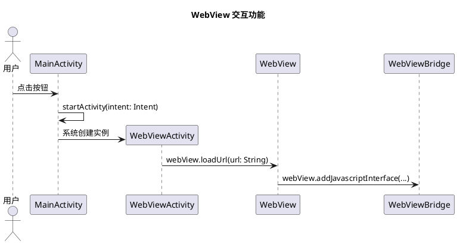

以下是将项目所有核心规范、文档结构、二次开发指南等内容整合到一个文件中的完整 Markdown 文档。您可以将其保存为 developer_doc/项目开发与二次开发指南.md。

markdown
# 项目开发与二次开发指南

> 本文档是项目的**核心开发手册**，汇总了所有设计规范、文档结构、任务管理流程和二次开发指南。  
> 遵循本指南，可确保项目长期可维护、可扩展，并支持高效的二次开发。

## 目录

- [一、项目概述](#一项目概述)
- [二、核心设计思想](#二核心设计思想)
- [三、项目结构规范](#三项目结构规范)
- [四、文档索引体系](#四文档索引体系)
- [五、代码注释与KDoc规范](#五代码注释与kdoc规范)
- [六、时序图规范](#六时序图规范)
- [七、任务管理规范](#七任务管理规范)
- [八、二次开发标准流程](#八二次开发标准流程)
- [九、附录：常见问题](#九附录常见问题)

---

## 一、项目概述

本项目是一个 **“智能数据采集终端 + Netlify 后端客户端”** 的混合应用。主要特点：

- **双模式交互**：用户通过 WebView 主动交互 + 后台自动采集传感器数据。
- **数据处理流水线**：抽象原始数据 → 转化数据 → 消费数据三个阶段。
- **本地优先与离线同步**：数据先存入 Room，网络恢复后由 WorkManager 自动上传。
- **模块化分离**：纯逻辑代码在 `domain` 模块，Android 相关代码在 `app` 模块。
- **文档驱动**：所有设计文档与代码同步，支持快速二次开发。

---

## 二、核心设计思想

### “一功能、一场景、一入口、一时序、一目录”

每个功能在项目中拥有以下五个“一”，确保信息内聚、易于查找：

- **一功能**：用唯一的功能名称标识（如 `sensor_upload`）。
- **一场景**：描述该功能解决的业务场景。
- **一入口**：主入口类（如 `SensorUploadWorker`），点击链接直达源码。
- **一时序**：PlantUML 时序图，生命线即类名，消息即方法签名。
- **一目录**：在 `developer_doc/features/<功能名称>/` 下存放设计文档和配套设施。

### 其他关键原则

- **类名即文件名**：每个公共类必须放在同名的 `.kt` 文件中。
- **模块分离**：与 Android 无关的代码放在 `domain` 模块。
- **图码一致**：时序图与代码严格对应，生命线名称、方法签名完全一致。
- **契约式任务**：使用 Given-When-Then 描述任务，明确输入、输出、依赖。

---

## 三、项目结构规范

### 3.1 代码目录（简化）
```
app/src/main/java/com/sea/auspicious_sign/
├── MainActivity.kt
├── webview/
├── sensor/collector/
├── sensor/upload/
├── data/local/
├── ui/settings/
├── upload_data/
└── utils/
```

```
domain/src/main/java/com/sea/auspicious_sign/domain/
├── model/
├── processor/
└── strategy/
```


### 3.2 文档目录（`developer_doc/`）
```
developer_doc/
├── read.md # 二次开发快速指南（本文件）
├── 总览.md # 所有核心文件索引
├── 功能映射表.md # 功能快速导航（核心入口）
├── 全部核心任务.md # 任务清单与状态
├── 任务执行顺序.md # 功能依赖与执行顺序
├── 时序生命线_作用.md # 时序图生命线与代码文件映射
├── 基础数据结构.md # 数据结构文档总览
├── 基础数据处理接口.md # 处理接口文档总览
├── domain模块总览.md
├── ... (其他架构文档)
└── features/ # 按功能组织的设计目录
├── sensor_upload/
│ ├── experiment/ # 测试辅助文件（本地服务器、脚本等）
│ └── ui/
│ ├── sensor_upload_代码.md # 配置项与代码文件链接
│ └── sensor_upload_界面.md # UI 设计说明
├── webview_interaction/
└── ... (其他功能)

```

---

## 四、文档索引体系

### 4.1 `总览.md`

以表格形式列出所有核心文件（含链接），按模块分组。是项目的“地图”。

### 4.2 `功能映射表.md`

每个功能一行，包含以下列（点击链接跳转）：

| 目标 | 场景 | 功能 | 功能名称 | 包路径 | 主入口类 | 启动方法 | 数据模型 | 处理接口 | 测试类 | 时序图 | features_dir |
|------|------|------|----------|--------|----------|----------|----------|----------|--------|--------|--------------|

**核心作用**：从功能名称直达主入口类、时序图、设计目录。

### 4.3 `全部核心任务.md`

任务清单，每行包含：ID、功能名称、任务描述、相关文件、作用、状态、时序图、配置项。  
任务 ID 链接到 `任务执行顺序.md`。

### 4.4 `任务执行顺序.md`

以功能为单位，列出每个功能下的任务顺序，并标注依赖关系、预期产出、状态。

### 4.5 `时序生命线_作用.md`

列出每个时序图中生命线对应的代码文件路径和作用，实现“图码双向查找”。

### 4.6 `features/` 目录

每个功能子目录下：
- `ui/<功能名称>_代码.md`：配置项表格，链接到代码文件。
- `ui/<功能名称>_界面.md`：界面设计说明，链接到 UI 源码。
- `experiment/`（可选）：本地测试服务器、模拟脚本等。

---

## 五、代码注释与KDoc规范

### 5.1 文件头 TODO 注释（必须）

每个源代码文件（`.kt`, `.java`, `.xml`, `.gradle`, `.properties`）顶部添加：

- Kotlin/Java：`// TODO: 作用 -- 简要描述该文件的职责`
- XML：`<!-- TODO: 作用 -- 简要描述 -->`
- Gradle/Properties：`# TODO: 作用 -- 简要描述`
    

### 5.2 KDoc 类注释

每个公共类必须包含 KDoc，内容包括：
- 职责描述
- 显式依赖（构造函数参数）
- 隐性依赖（需要的环境状态，如数据库存在未同步数据、配置已设置等）
- 使用 `@see` 链接到时序图或相关任务

示例：
```kotlin
/**
 * 传感器数据上传 Worker
 *
 * @param uploader 上传执行器
 * @param baseRequest 请求模板
 *
 * 隐性依赖：
 * - 数据库 raw_data 表中存在 synced = 0 的记录
 * - DataStore 中已配置 API_BASE_URL
 *
 * @see [sensor_upload.plantuml]
 */
class SensorUploadWorker(...)
```
### 5.3 方法 KDoc
```
所有公共方法必须使用 KDoc，标注 @param, @return, @throws。
```
## 六、时序图规范
### 6.1 基本规则
```text
生命线名称 = 类名（与代码文件名一致）
消息标注 = 完整方法签名（包括参数类型，如 loadUrl(url: String)）。

箭头语义：

-> 实线：同步调用（等待返回）。

--> 虚线：返回值或异步回调。

A -> A：自调用。

create B：创建对象。
```

### 6.2 示例（webview_interaction.plantuml）




### 6.3 时序图与代码的双向链接

```text
在时序图文件头部注释中注明对应的功能名称和主要源码文件。

在源码类的 KDoc 中使用 @see 链接到时序图文件。
```
## 七、任务管理规范
### 7.1 任务拆解原则
```text
原子性：一个任务只完成一个明确的工作单元。

可验证：有明确的预期产出。

契约式描述：使用 Given-When-Then 格式。
```

### 7.2 任务示例
```text
任务 T-012
Given：数据库中已有未同步数据，Uploader 和 AppPreferences 可用。
When：执行 SensorUploadWorker.doWork()。
Then：所有未同步数据被分批上传，且 synced 更新为 1。
```
### 7.3 三层依赖
```text
显式依赖（构造参数）：如 uploader, baseRequest。

显式依赖（方法参数）：如 doWork() 无参数，但一般方法的输入。

隐性依赖（全局状态）：如数据库状态、DataStore 配置，在 KDoc 中列出，且在任务内部用 require/check 验证。
```
## 八、二次开发标准流程
### 8.1 确定要修改或新增的功能
```text
打开 功能映射表.md，浏览功能名称和场景。

若已有功能，直接定位；若没有，需新建功能（见 8.5）。
```

### 8.2 深入理解已有功能
```text
点击“主入口类”链接，阅读源码。

点击“时序图”链接，查看 .plantuml，理解交互流程。

点击 features_dir 链接，进入功能设计目录，查看 ui/ 下的配置和界面文档。
```
### 8.3 阅读代码的关键点
```text
文件头 // TODO: 作用：了解文件职责。

KDoc 类注释：显式依赖 + 隐性依赖。

方法内的 require/check：运行时前置条件。
```
### 8.4 修改或新增
```text
修改：按时序图修改对应类和方法，同步更新时序图、配置文档、任务状态。

新增：见 8.5。
```
### 8.5 新增功能完整步骤
```text
确定功能名称（小写+下划线，如 new_feature）。

绘制时序图：创建 developer_doc/<功能名称>.plantuml。

创建设计目录：features/<功能名称>/ui/ 和可选的 experiment/。

编写 ui/<功能名称>_代码.md：列出配置项、代码文件链接。

编写 ui/<功能名称>_界面.md：描述 UI 设计。

更新 功能映射表.md：添加新行，填写所有列。

拆解任务：在 全部核心任务.md 中添加任务，关联功能名称。

定义执行顺序：在 任务执行顺序.md 中插入新功能及其任务。

实现代码：创建主入口类，添加文件头 TODO 和 KDoc。

测试并提交。
```

## 九、附录：常见问题
```text
Q：时序图中的生命线名称与代码文件名不一致怎么办？
A：这是严重错误，必须修正。确保文件名与生命线名称完全一致（包括大小写）。

Q：如何快速找到某个类的所有相关文档？
A：在 总览.md 中搜索类名；在 时序生命线_作用.md 中查找对应的时序图。

Q：修改配置项后，需要更新哪些文档？
A：更新对应功能 ui/ 下的 _代码.md 表格，以及 全部核心任务.md 中的配置项列。

Q：experiment/ 目录应该放什么？
A：存放该功能开发时使用的临时工具（本地 mock 服务器、测试数据生成器、模拟网页等），不包含生产代码。

Q：项目文档和代码如何保持同步？
A：每次修改代码后，必须同步更新受影响的时序图、功能映射表、任务文档，否则文档会失效。
```
遵循本指南，您可以在遗忘项目细节后，通过文档快速恢复开发能力，高效完成二次开发任务。

text

请将此文件保存为 `developer_doc/项目开发与二次开发指南.md`。此文档已整合了之前讨论的所有规范、文档结构、二次开发流程，并可作为项目的**核心开发手册**。